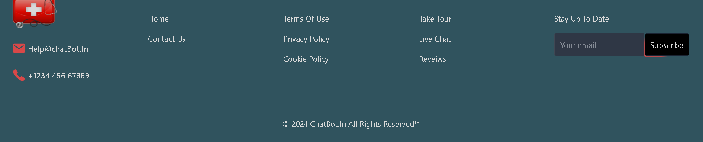

# Patient Dashboard and Chatbot Access

## Objective
The purpose of this project is to build a patient dashboard with access to a chatbot, including session management, interaction logging, and displaying linked doctor information.

## Features
1. **Patient Dashboard**:
    - View patient profile.
    - View interaction history with the chatbot.
    - View linked doctor information.

2. **Chatbot Interface**:
    - Embed a chatbot widget into the dashboard.
    - Submit text queries to the chatbot.
    - Display chatbot responses in real-time.

3. **Session Management**:
    - Maintain context of patient interactions.
    - Store interaction histories in a PostgreSQL database.

4. **Database Schema**:
    - Store patient profiles, interaction histories, and linked doctor information.
    - Ensure efficient retrieval of past interactions and linked doctor details.

## Technical Stack
- **Frontend**: React
- **Backend**: Node.js with Express
- **Database**: PostgreSQL


## Installation

1. **Clone the repository**:
    ```bash
    git clone https://github.com/Chandan8018/patientChatbot.git

    ```

2. **Docker Compose**:
    ```bash
    docker-compose up -d
    ```

3. **Backend Setup**:
    ```bash
    npm install
    ```

4. **Frontend Setup**:
    ```bash
    cd frontend
    npm install
    ```

5. **Environment Variables**:
    - Create a `.env` file in the root of the `root` directory and add your MongoDB URI, JWT secret, and other necessary environment variables.
    - Create a `.env` file in the root of the `frontend` directory and add your Firebase and other necessary environment variables.

## Usage
1. **Start the backend server**:
    ```bash
    npm run dev
    ```

2. **Start the frontend server**:
    ```bash
    cd frontend
    npm run dev
    ```

3. **Open your browser** and navigate to `http://localhost:3000` to view the application.

### Home Page

The Home Page is designed to welcome users with an attractive macbook-scroll  and interactive elements.

### Sign In / Sign Up

Users can sign in or register for a new account. These forms handle user input and manage state using Redux.


## Folder Structure

```sh
.
├── api
|   ├── controllers
|   |   ├── auth.controller.js
|   |   ├── message.controller.js
|   |   └── user.controller.js 
|   ├── routes
|   |   ├── auth.route.js
|   |   ├── message.route.js
|   |   └── user.route.js
|   ├── models
|   |   ├── conversation.model.js
|   |   ├── message.model.js
|   |   └── user.model.js
|   ├── socket
|   |   └── socket.js
|   ├── utils
|   |   ├── database.js
|   |   ├── error.js
|   |   └── verifyUser.js
|   └── index.js
├── config
|   └── config.json  
├── db
|   └── docker-compose.yml  
├── frontend
|   ├── public
|   ├── src
│   |   ├── components
│   │   |   ├── footer
│   │   │   |   └── FooterComp.jsx
│   │   |   ├── header
│   │   │   |   └── Header.jsx
│   │   |   ├── privateroute
│   │   │   |   └── PrivateRoute.jsx
│   │   |   ├── invoices
│   │   │   |   ├── FullFeaturedCrudGrid.jsx
│   │   │   |   └── Invoice.jsx
│   │   |   ├── googleConfig
│   │   │   |   └── OAuth.jsx
│   │   |   ├── messages
│   │   │   |   ├── Message.jsx
|   |   |   |   ├── MessageContainer.jsx  
|   |   |   |   ├── MessageInput.jsx  
|   |   |   |   └── SidebarIcons.jsx
│   │   |   ├── sidebar
│   │   │   |   ├── Conversation.jsx
|   |   |   |   ├── Conversations.jsx  
|   |   |   |   ├── SearchInput.jsx  
|   |   |   |   └── Sidebar.jsx
│   │   |   ├── skeletons
│   │   │   |   └── MessageSkeleton.jsx
│   │   |   ├── theme
│   │   │   |   └── ThemeProvider.jsx
│   │   |   ├── ui
│   │   │   |   └── Various UI Components
│   │   |   ├── context
│   │   │   |   └── SocketContext.jsx
│   │   |   ├── hook
│   │   │   |   └── useListenMessages.js
│   │   |   └── lib
│   │   │       └── utils.js
│   |   ├── pages
│   │   |   ├── Chat.jsx
│   │   |   ├── Contact.jsx
│   │   |   ├── Home.jsx
│   │   |   ├── Profile.jsx
│   │   |   ├── SignIn.jsx
│   │   |   └── SignUp.jsx
│   |   ├── redux
│   │   |   ├── theme
│   │   |   │   └── themeSlice.js
│   │   |   └── user
│   │   |       └── userSlice.js
│   |   ├── zustand
│   │   |   └── useConversation.js
│   |   ├── .env
│   |   ├── App.jsx
│   |   ├── main.jsx
│   |   ├── firebase.js
│   |   └── index.css
|   ├── .eslintrc.js
|   ├── .gitignore
|   ├── index.html
|   ├── package-lock.json
|   ├── package.json
|   ├── postcss.config.js
|   ├── tailwind.config.js
|   └── vite.config.js
├── .gitignore
├── package-lock.json
├── package.json
└── README.md
```
## Demo
- Doctor Chat with Patient Page

---
- Patient Chat with Doctor Page

---
- Home Page



---
- Sign-Up Page

---
- Sign-In Page

---
- Doctor Profile Update Page

---
- Patient Profile Update Page

---

## Contact
For any questions or inquiries, please contact:

- Author: Chandan Kumar Sahoo
- Email: chandankumarsahoo19@gmail.com
- GitHub: https://github.com/Chandan8018/

Feel free to reach out for any questions, suggestions, or contributions. Happy coding!

